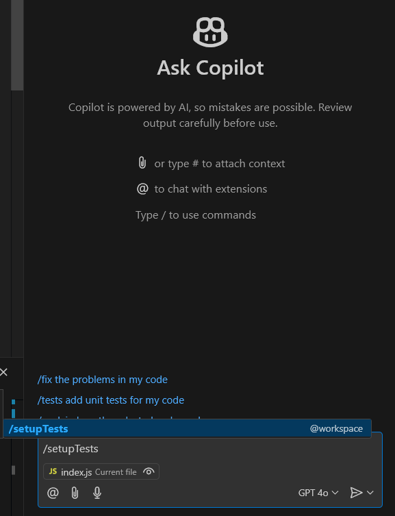
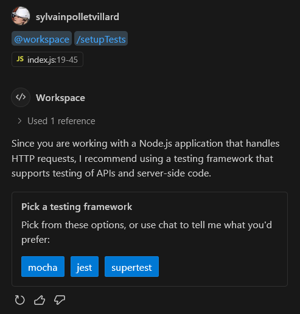
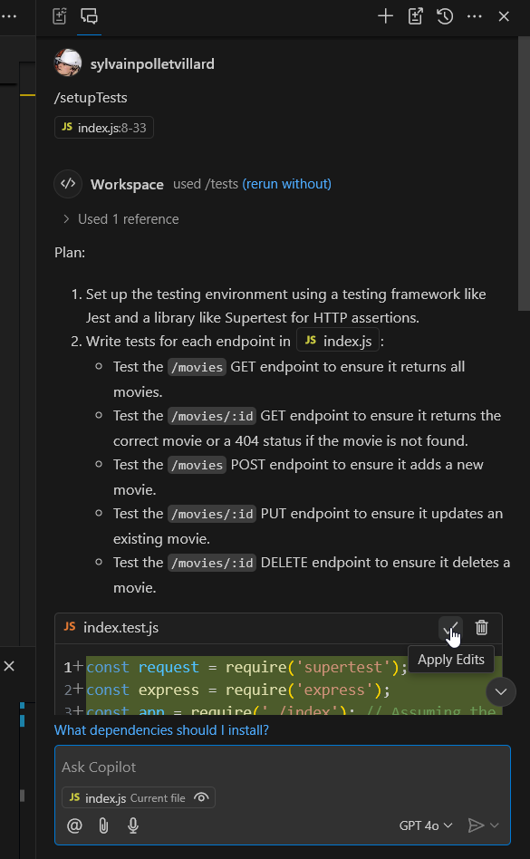
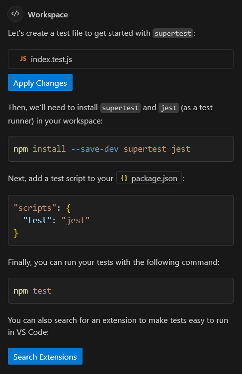
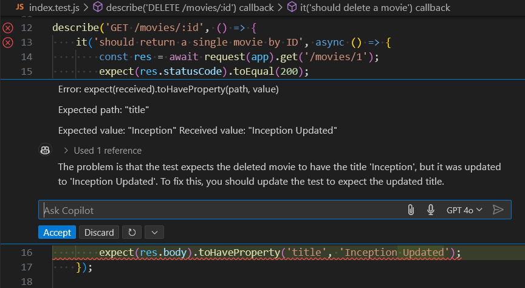
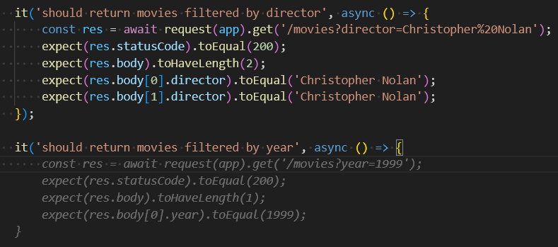

# Develop with AI

## Github Copilot

::: tip Update
Copilot can now use other LLMs than OpenAI, including Google, and Anthropic to provide code suggestions 
:::

Github Copilot is a tool that uses the OpenAI language models to provide code suggestions and suggestions for improving code quality.

::: tip Alternative code assistance
There is also other producs indegrated to IDEs such as :
* [Gitlab Duo](https://about.gitlab.com/fr-fr/gitlab-duo/),
* [Gemini Code Assist](https://cloud.google.com/gemini/docs/codeassist/overview?hl=fr), 
* [SuperMaven](https://supermaven.com/), 
* [AWS CodeWhisperer](https://docs.aws.amazon.com/codewhisperer/latest/userguide/what-is-cwspr.html), and more.
:::

### Copilot Chat

Copilot Chat is a chat interface that allows you to ask questions and get suggestions for code improvements.

it's available on : 
- [JetBrains IDEs](https://plugins.jetbrains.com/plugin/17718-github-copilot)
- [Visual Studio](https://visualstudio.microsoft.com/fr/github-copilot/)
- [Visual Studio Code](https://marketplace.visualstudio.com/items?itemName=GitHub.copilot-chat)
- In [Github mobile App](https://github.com/mobile)
- Web version in [github.com (Preview)](https://docs.github.com/fr/enterprise-cloud@latest/copilot/using-github-copilot/asking-github-copilot-questions-in-github)

It is a similar approach to chat GPT prompting optimised for the developper experience.

### CLI
CLI helps you using you command line interpreter
You can use it in the terminal with the following command:

```bash
gh auth login
gh extension install github.copilot
gh copilot explain "traceroute github.com"
```
::: warning
Github CLI is not supported yet with our Worldline account, so you need to use the web version with the link here
:::

### IDEs integration (VSCode)

#### Completion


#### Generation & Refactoring


#### Assistance


#### Test generation


::: tip Sortcut usage of Copilot chat

You can also use the chat interface to ask questions with shortcuts :
- `/ask`
-  `/explain`
- `/generate` 
- `/refactor`
- `/test`
- `/setupTest`
- ...


:::

#### Documentation


#### Architecture diagram

[Mermaid diagrams](https://mermaid.live/) is a great tool to create diagrams in markdown files online. With copilot you can generate a diagram based on the code you write or chat with copilot to generate the diagram.

``` text
Generate a mermaid architecture diagram for a simple retail app with product catalog, product details , buying tunnel , loyalty. Be detailed. I want to make this app with express node JS Rest API server, please provide the diagram for the server side. Suggest technical stack on the diagram , name the component variables. Parentheses are not supported by mermaid.
```


```sh
graph TD;
    A[Client Application] -->|HTTP Requests| B[Express.js REST API Server]
    B -->|Fetch Products| C[Product Controller - productController]
    B -->|Fetch Product Details| D[Product Details Controller - productDetailsController]
    B -->|Handle Cart Operations| E[Cart Controller - cartController]
    B -->|Process Orders| F[Order Controller - orderController]
    B -->|Manage User Accounts| G[User Controller - userController]
    B -->|Handle Loyalty Program| H[Loyalty Controller - loyaltyController]
    
    subgraph Database
        I[MongoDB - mongoose]
    end
    
    subgraph Middleware
        J[Authentication Middleware - passport]
        K[Error Handling Middleware - errorHandler]
        L[Logging Middleware - morgan]
    end
    
    B -->|Connects to| I
    B -->|Uses| J
    B -->|Uses| K
    B -->|Uses| L
    
    C -->|CRUD Operations| I
    D -->|CRUD Operations| I
    E -->|CRUD Operations| I
    F -->|CRUD Operations| I
    G -->|CRUD Operations| I
    H -->|CRUD Operations| I
```

## 🧪 Exercise

### Install Github Copilot on VSCode

1. Install the [Github Copilot extension](https://marketplace.visualstudio.com/items?itemName=github.copilot) on your VSCode
2. Sign in with your Github account, if not already done
3. Create a new file and start typing a function or a class, to see the suggestions provided by Copilot

### Generating unit tests

We"re going to use Github Copilot to generate unit tests for a simple JavaScript project repository.

To run the project and unit tests, you will need [NodeJs](https://nodejs.org/en/download/) installed on your machine.

1. Clone the following repository: [github.com/worldline/learning-ai-workspace-js](https://github.com/worldline/learning-ai-workspace-js)
2. Open the project in your VSCode
3. Open Github Copilot Chat by clicking on the Copilot icon in the bottom right corner of your VSCode
4. Ask Copilot to generate unit tests for the `index.js` file . You can also try the `/setupTests` command
5. Copilot may make several suggestions: choosing a testing framework, adding a `test` command to package.json, install new dependencies. Accept all its suggestions.
6. Try to run the generated tests. In case of trouble, use Copilot Chat to ask for help.


<details>
<summary>Solution</summary>

<p>Here we decided to go with supertest framework</p>





<p>Here is an example of how Copilot can help you fix a failing test:</p>



</details>

### Refactoring

Now we are going to use Copilot to refactor a piece of code in the same project. 

1. Open the `index.js` file in the project
2. Ask Copilot to add a feature in the GET /movies endpoint that allows filtering movies by director, based on a `director` query parameter.
3. Copilot will generate the code for you. Try to understand the changes it made and run the project to test the new feature.
4. Ask Copilot to complete the unit test in `index.test.js` to test getting movies filtered by director. It should generate more unit tests that check against one of the directors in the example data.
5. Now we're going to refactor the code to extract the filtering logic into a separate function. Select the parts of the code with the `.find()` and `.filter()` function calls and ask Copilot to extract them into a new function. Let Copilot suggest a name for these functions
6. Under the previous generated function, type `function filterMoviesByYear(`. Wait for Copilot to suggest you the rest of the function signature and function body. Accept the suggestion using the `Tab` key.
7. Ask Copilot again to allow filtering movies by a `year` query parameter. Copilot should use the `filterMoviesByYear` function you just created to implement this feature.
8. Open `index.test.js`. In the `GET /movies` test block, add a new assertion block by typing `it('should return movies filtered by year',`. Wait for Copilot to suggest you the rest of the tests. Review code to make sure it uses the ?year query parameter and checks correctly a date from the example data.
9. Run the tests to make sure everything is working as expected. Use Copilot to ask for help if needed.

<details>
<summary>Solution</summary>

<p>Adding the new feature</p>


<p>Complete the test</p>


<p>Refactor the code to extract logic</p>


<p>Get code suggestion from a function name</p>


<p>Refactor with Copilot Chat the API logic</p>


<p>Get code suggestion from test description</p>

</details>

## Gihub Spark

[GitHub Spark](https://githubnext.com/projects/github-spark#introducing-github-spark) is an AI-powered tool for creating and sharing micro apps (“sparks”), which can be tailored to your exact needs and preferences, and are directly usable from your desktop and mobile devices. Without needing to write or deploy any code.

And it enables this through a combination of three tightly-integrated components:

* An NL-based editor, which allows easily describing your ideas, and then refining them over time
* A managed runtime environment, which hosts your sparks, and provides them access to data storage, theming, and LLMs
* A PWA-enabled dashboard, which lets you manage and launch your sparks from anywhere


## 🧪 Exercise

::: warning TODO
#### Use vercel V0 or github spark to create an application that ... 
:::

## 📖 Further readings
* [Worldline AI coding assistant](https://confluence.worldline-solutions.com/display/AICA/AI+Coding+Assistants+Home)
* [Worldline Data platform](https://confluence.worldline-solutions.com/display/DPTECHNO/Data+Platform)
* [Copilot trust Center](https://resources.github.com/copilot-trust-center/)
* [Chat with your IDE](https://docs.github.com/en/copilot/github-copilot-chat/using-github-copilot-chat-in-your-ide)

