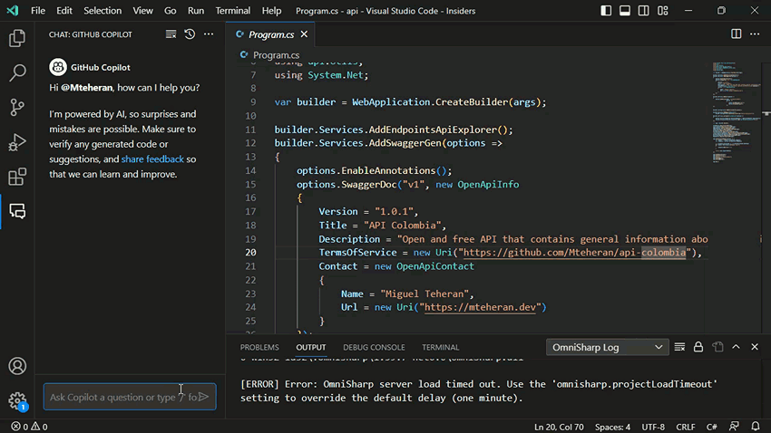
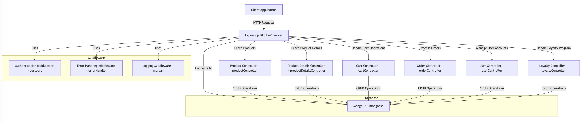

# Develop with AI

## Github Copilot

::: tip Update
Copilot can now use other LLMs than OpenAI, including Google, and Anthropic to provide code suggestions 
:::

Github Copilot is a tool that uses the OpenAI language models to provide code suggestions and suggestions for improving code quality.

::: tip Alternative code assistance
There is also other producs indegrated to IDEs such as :
* [Gitlab Duo](https://about.gitlab.com/fr-fr/gitlab-duo/),
* [Gemini Code Assist](https://cloud.google.com/gemini/docs/codeassist/overview?hl=fr), 
* [SuperMaven](https://supermaven.com/), 
* [AWS CodeWhisperer](https://docs.aws.amazon.com/codewhisperer/latest/userguide/what-is-cwspr.html), and more.
:::

### Copilot Chat

Copilot Chat is a chat interface that allows you to ask questions and get suggestions for code improvements.

it's available on : 
- [JetBrains IDEs](https://plugins.jetbrains.com/plugin/17718-github-copilot)
- [Visual Studio](https://visualstudio.microsoft.com/fr/github-copilot/)
- [Visual Studio Code](https://marketplace.visualstudio.com/items?itemName=GitHub.copilot-chat)
- In [Github mobile App](https://github.com/mobile)
- Web version in [github.com (Preview)](https://docs.github.com/fr/enterprise-cloud@latest/copilot/using-github-copilot/asking-github-copilot-questions-in-github)

It is a similar approach to chat GPT prompting optimised for the developper experience.

### CLI
CLI helps you using you command line interpreter
You can use it in the terminal with the following command:

```bash
gh auth login
gh extension install github.copilot
gh copilot explain "traceroute github.com"
```
::: warning
Github CLI is not supported yet with our Worldline account, so you need to use the web version with the link here
:::

### IDEs integration (VSCode)

#### Completion


#### Generation & Refactoring


#### Assistance



#### Test generation


::: tip Sortcut usage of Copilot chat

You can also use the chat interface to ask questions with shortcuts :
- `/ask`
-  `/explain`
- `/generate` 
- `/refactor`
- `/test`
- `/setupTest`
- ...


:::

#### Documentation


#### Architecture diagram

[Mermaid diagrams](https://mermaid.live/) is a great tool to create diagrams in markdown files online. With copilot you can generate a diagram based on the code you write or chat with copilot to generate the diagram.

``` text
Generate a mermaid architecture diagram for a simple retail app with product catalog, product details , buying tunnel , loyalty. Be detailed. I want to make this app with express node JS Rest API server, please provide the diagram for the server side. Suggest technical stack on the diagram , name the component variables. Parentheses are not supported by mermaid.
```





## 🧪 Exercise

::: warning TODO
#### Install Github Copilot on VSCode and generate tests for the following project repository
#### Use Copilot to refactor the following project repository
:::

## Gihub Spark

[GitHub Spark](https://githubnext.com/projects/github-spark#introducing-github-spark) is an AI-powered tool for creating and sharing micro apps (“sparks”), which can be tailored to your exact needs and preferences, and are directly usable from your desktop and mobile devices. Without needing to write or deploy any code.

And it enables this through a combination of three tightly-integrated components:

* An NL-based editor, which allows easily describing your ideas, and then refining them over time
* A managed runtime environment, which hosts your sparks, and provides them access to data storage, theming, and LLMs
* A PWA-enabled dashboard, which lets you manage and launch your sparks from anywhere


## 🧪 Exercise

::: warning TODO
#### Use vercel V0 or github spark to create an application that ... 
:::

## 📖 Further readings
* [Worldline AI coding assistant](https://confluence.worldline-solutions.com/display/AICA/AI+Coding+Assistants+Home)
* [Worldline Data platform](https://confluence.worldline-solutions.com/display/DPTECHNO/Data+Platform)
* [Copilot trust Center](https://resources.github.com/copilot-trust-center/)
* [Chat with your IDE](https://docs.github.com/en/copilot/github-copilot-chat/using-github-copilot-chat-in-your-ide)

