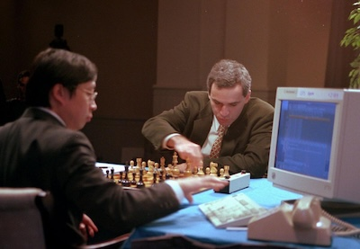
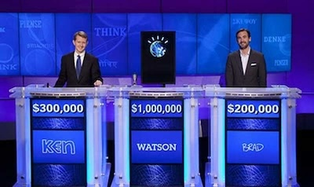
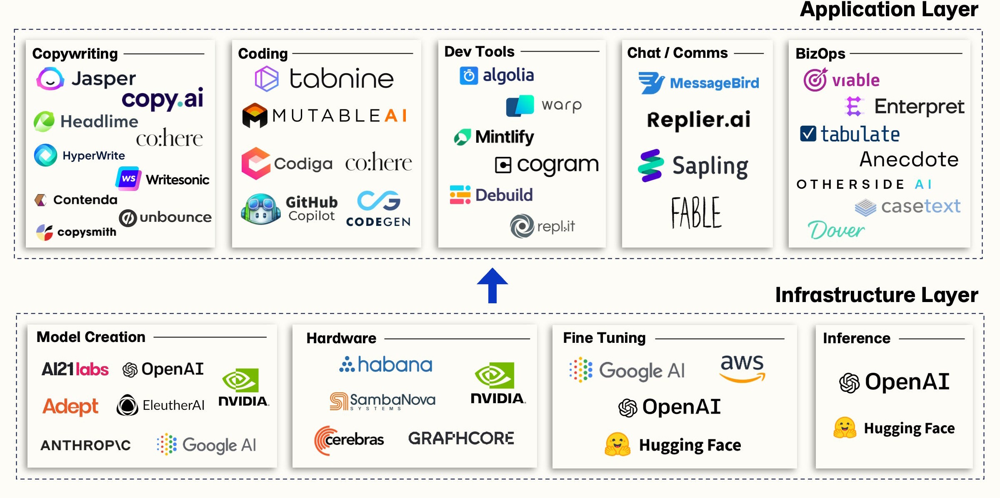

# Let's start 
::: warning
 LLMs and MMLLMs are constantly evolving, and new applications for developer training are emerging all the time.
 :::

## Prerequisites

#### **Shell Command Line Skills:** 
The AI should include support for providing guidance on using shell commands, navigating file systems, and executing command-line operations across different operating systems.

#### **Understanding of HTTP and API:** 
Proficiency in HTTP protocol, RESTful API concepts, and web service integration is crucial for the AI to provide support on API design, consumption, and troubleshooting common API-related issues.

#### **Basic Cloud Knowledge:**
Understanding of cloud computing principles, including basic concepts of cloud infrastructure, services, and deployment models, will enable the AI to offer guidance on cloud-based development, deployment, and best practices.

::: warning 
Additionnaly, **Request Worldline librechat access:** send a mail at  [Generative AI Taskforce email](mailto:GenAITaskforce@worldline.com)
:::

## Definitions 

### LLM 
Large Language Model is a powerful type of AI model trained on massive datasets of text and code. LLMs can understand, generate, and manipulate language.
Ex : ChatGPT, Bard, Codex

*What are Large Language Models (LLMs)? by Google for developpers*
<iframe width="560" height="315" src="https://www.youtube.com/embed/iR2O2GPbB0E" title="What are Large Language Models (LLMs)? by Google for developpers" frameborder="0" allow="accelerometer; autoplay; clipboard-write; encrypted-media; gyroscope; picture-in-picture" allowfullscreen></iframe>

### MMLLM
Multi-Modal Large Language Model is an advanced LLM that can process and generate both text and other data formats like images, audio, or video. 
Ex:  DALL-E 2, Stable Diffusion (for image generation)

### ML
Machine Learning is a subset of AI that focuses on training algorithms to learn from data and make predictions or decisions without explicit programming. ML powers many AI applications, including image recognition, natural language processing, and predictive analytics. 

### DL
Deep Learning is a type of ML that uses artificial neural networks with multiple layers to learn complex patterns from data.DL has revolutionized fields like computer vision, speech recognition, and machine translation. 

### Neural Network
A computational model inspired by the structure of the human brain, consisting of interconnected nodes (neurons) organized in layers.Neural networks are the core building blocks of deep learning models. 

#### NLP
Natural Language Processing is a branch of Artificial Intelligence (AI) that focuses on enabling computers to understand, interpret, and generate human language. It implies : 
- Text Analysis
- Language Understanding
- Text Generation
- Translation
- Speech Recognition: Powers voice assistants and speech-to-text technologies

#### **Prompt:**
A specific set of instructions or questions given to an LLM to guide its response. Well-crafted prompts are crucial for getting accurate and relevant output from LLMs. 
Ex :  "Write a Python function to check if a string is a palindrome."

#### **Token:**
The smallest unit of meaning processed by an LLM.  Tokens can be words, parts of words, punctuation marks, or special characters. LLMs process text by analyzing sequences of tokens, making it important to understand how they are broken down.
Ex : The sentence "I love programming" would be split into the following tokens: "I", "love", "programming".

#### **Temperature:**
A parameter in some LLMs that controls the randomness or creativity of the generated text. Adjust temperature based on the desired level of creativity or accuracy in the LLM's output.
* A higher temperature generate more randomness and unpredictability in the output.
* A lower temperature generate more predictable and coherent output.

#### **RAG: Retrieval Augmented Generation**
RAG (Retrieval Augmented Generation) is a powerful technique in the field of Natural Language Processing (NLP) that combines the best of both worlds: information retrieval and language generation.

* The system first retrieves relevant information from a vast knowledge base (often a database or a set of documents) based on the user's query or prompt.
* This retrieved information is then used to augment the language model's input, providing it with more context and specific facts. 
* Finally, the language model uses this augmented input to generate a more comprehensive and informative response, leveraging both its knowledge base and its language generation capabilities.

## A bit of History
AI's history has been marked by periods of progress and setbacks. Computing power, data availability, and algorithmic advancements have played crucial roles in AI's evolution. AI is no longer limited to expert systems but encompasses a wide range of techniques and applications.

* **1950:** Alan Turing proposes the "Turing Test" to assess machine intelligence.

During the turing test, the human questioner asks a series of questions to both respondantes. After the specified time, the questionner tries to decide which terminal is operated bu the human respondant and which terminal is operated by the computer.

* **1956:** Dartmouth Conference establishes the field of "Artificial Intelligence".
* **1959:** Arthur Samuel develops a checkers-playing program that learns and improves over time.

* **1960s:** Research focused on logic-based reasoning and early expert systems.
* **1972:** The first expert system, DENDRAL, is developed for identifying organic molecules. 
* **1980s-1990s:** Development of new techniques like machine learning and neural networks.
* **1997:** Deep Blue, a chess-playing computer, defeats Garry Kasparov, the world chess champion.

* **1990s-2000s:**  Advances in computing power, data availability, and algorithms as fuel for AI progress.

* **2010s:**  Deep learning revolutionizes AI with breakthroughs in image recognition, speech recognition, and natural language processing.
* **2011:** Watson, an IBM supercomputer, wins Jeopardy! against human champions.

* **2016:** AlphaGo, a program developed by Google DeepMind, defeats Go champion Lee Sedol.

* **2022:** First release of ChatGPT : AI continues to evolve rapidly, with advancements in areas like autonomous vehicles, robotics, and personalized medicine.

 ## The market
 

 ## 📖 Further readings
 * [Generative AI Taskforce email](mailto:GenAITaskforce@worldline.com)

